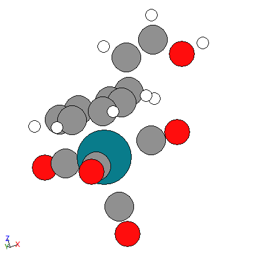

## Complex_Gen
Complex_Gen is designed for generating initial structures for transition metal based homogeneous complex catalyst. It allows user to define ligands based on SMILES representation or ASE ATOMS object, and automatically places ligand on center metal atom based on geometry. It is still under development.

## Installation

Download the source code from github and install it using pip:

```bash
git clone https://github.com/Long1Corn/Complex_Gen.git

cd Complex_Gen
 
pip install .
```

## Usage
A sample code can be found [here](sample_codes.ipynb).
```python
# Define a ligand based on SMILES representation
ligand1 = Ligand(smiles="c1ccccc1CC=CO", binding_sites_idx=[0,1,2,3,4,5])

# Define a ligand based on ASE ATOMS object
def CO():
    C1 = Atom('C', (0, 0, 0))
    O1 = Atom('O', (0, 0, 1.2))
    return Atoms([C1, O1])
    
ligand2 = Ligand(structure=CO(), binding_sites_idx=[0], sites_loc_idx=[1])
ligand3 = Ligand(structure=CO(), binding_sites_idx=[0], sites_loc_idx=[2])
ligand4 = Ligand(structure=CO(), binding_sites_idx=[0], sites_loc_idx=[3])
ligand5 = Ligand(structure=CO(), binding_sites_idx=[0], sites_loc_idx=[4])

# Define the complex based on center metal atom and coordination number
com = Complex(center_atom="Rh",
              ligands=[ligand1, ligand2, ligand3, ligand4, ligand5],
              shape="pentagonal_bipyramidal")

com.generate_complex()

# View the complex
view(com.complex)
```

